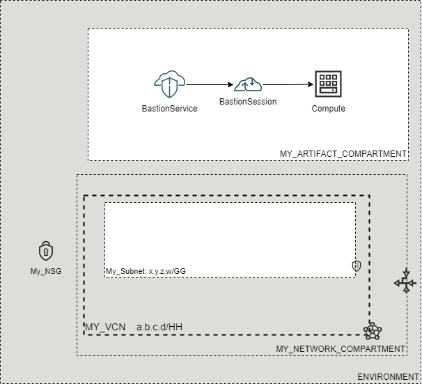

# terraform-oci-cloudbricks-bastionservice-sessions

[](https://img.shields.io/badge/license-UPL-green) [](https://sonarcloud.io/dashboard?id=oracle-devrel_terraform-oci-cloudbricks-bastionservice-sessions)

## Introduction
The following brick allows for creation of Bastion Sessions that connect to a Bastion Service and comupute.

## Reference Architecture
The following is the reference architecture associated to this brick



### Prerequisites
- Pre-baked Network and Compartments Artifacts
- Pre-baked VCN
- A Bastion Service
- One or more compute instances

## Sample tfvar file

If setting up the sessions with Managed SSH:

```shell
######################################## COMMON VARIABLES ######################################
region           = "re-region-1"
tenancy_ocid     = "ocid1.tenancy.oc1..aaaaaaaabcedfghijklmonoprstuvwxyz"
user_ocid        = "ocid1.tenancy.oc1..aaaaaaaabcedfghijklmonoprstuvwxyz"
fingerprint      = "fo:oo:ba:ar:ba:ar"
private_key_path = "/absolute/path/to/api/key/your_api_key.pem"
######################################## COMMON VARIABLES ######################################
######################################## ARTIFACT SPECIFIC VARIABLES ######################################
ssh_public_key                            = "./relative/path/to/ssh/key/public_ssh_key.pub"
bastion_service_name                      = "MY_BASTION_SERVICE_NAME"
bastion_service_instance_compartment_name = "MY_BASTION_SERVICE_COMPARTMENT"

bastion_session_compute_list = [
  {
    "displayname" = "UnitaryBastionSession1"
    "id"          = "ocid1.instance.oc1.re-region-1.rgjheruerjhhjer"
    "type"        = "MANAGED_SSH"
    "username"    = "opc"
    "ttl"         = "10800"
  },
  {
    "displayname" = "UnitaryBastionSession2"
    "id"          = "ocid1.instance.oc1.re-region-1.ewrytrjytrndsgd"
    "type"        = "MANAGED_SSH"
    "username"    = "opc"
    "ttl"         = "10800"
  },
]
######################################## ARTIFACT SPECIFIC VARIABLES ######################################
```

If setting up the sessions with Port Forwarding:

```shell
######################################## COMMON VARIABLES ######################################
region           = "re-region-1"
tenancy_ocid     = "ocid1.tenancy.oc1..aaaaaaaabcedfghijklmonoprstuvwxyz"
user_ocid        = "ocid1.tenancy.oc1..aaaaaaaabcedfghijklmonoprstuvwxyz"
fingerprint      = "fo:oo:ba:ar:ba:ar"
private_key_path = "/absolute/path/to/api/key/your_api_key.pem"
######################################## COMMON VARIABLES ######################################
######################################## ARTIFACT SPECIFIC VARIABLES ######################################
ssh_public_key                            = "./relative/path/to/ssh/key/public_ssh_key.pub"
bastion_service_name                      = "MY_BASTION_SERVICE_NAME"
bastion_service_instance_compartment_name = "MY_BASTION_SERVICE_COMPARTMENT"

bastion_session_compute_list = [
  {
    "displayname" = "UnitaryBastionSession1"
    "id"          = "ocid1.instance.oc1.re-region-1.rgjheruerjhhjer"
    "type"        = "PORT_FORWARDING"
    "port"        = "22"
    "ttl"         = "10800"
  },
  {
    "displayname" = "UnitaryBastionSession2"
    "id"          = "ocid1.instance.oc1.re-region-1.ewrytrjytrndsgd"
    "type"        = "PORT_FORWARDING"
    "port"        = "22"
    "ttl"         = "10800"
  },
]
######################################## ARTIFACT SPECIFIC VARIABLES ######################################
```

### Variable specific considerations
- `bastion_session_compute_list` is a custom list of objects containing all the data needed to provision a session. Each object should contain:
  - a Display name: `displayname`
  - an id: `id`
  - a session type: `type` can be either `MANAGED_SSH` or `PORT_FORWARDING`
    - If using `MANAGED_SSH` a `username` should be specified. This is the SSH username used to connect to the compute. E.g. it should be `opc` for Oracle Linux instances.
    - If using `PORT_FORWARDING` a `port` should be specified. This is the port on which to connect to the instance with.
  - a time to live in seconds: `ttl`
  - *Note1*: None of these values have any defaults due to the object pattern used and for simplicity. Always specify exactly the variables you need.
  - *Note2*: Multiple services can obviously be created, and don't have to be of the same type.

### Sample provider
The following is the base provider definition to be used with this module

```shell
terraform {
  required_version = ">= 0.13.5"
}
provider "oci" {
  region       = var.region
  tenancy_ocid = var.tenancy_ocid
  user_ocid        = var.user_ocid
  fingerprint      = var.fingerprint
  private_key_path = var.private_key_path
  disable_auto_retries = "true"
}

provider "oci" {
  alias        = "home"
  region       = data.oci_identity_region_subscriptions.home_region_subscriptions.region_subscriptions[0].region_name
  tenancy_ocid = var.tenancy_ocid  
  user_ocid        = var.user_ocid
  fingerprint      = var.fingerprint
  private_key_path = var.private_key_path
  disable_auto_retries = "true"
}
```

## Variable documentation
## Requirements

No requirements.

## Providers

| Name | Version |
|------|---------|
| <a name="provider_oci"></a> [oci](#provider\_oci) | 4.53.0 |

## Modules

No modules.

## Resources

| Name | Type |
|------|------|
| [oci_bastion_session.bastion_session](https://registry.terraform.io/providers/hashicorp/oci/latest/docs/resources/bastion_session) | resource |
| [oci_bastion_bastions.BASTIONSERVICE](https://registry.terraform.io/providers/hashicorp/oci/latest/docs/data-sources/bastion_bastions) | data source |
| [oci_identity_compartments.COMPARTMENTS](https://registry.terraform.io/providers/hashicorp/oci/latest/docs/data-sources/identity_compartments) | data source |

## Inputs

| Name | Description | Type | Default | Required |
|------|-------------|------|---------|:--------:|
| <a name="input_bastion_service_instance_compartment_name"></a> [bastion\_service\_instance\_compartment\_name](#input\_bastion\_service\_instance\_compartment\_name) | Defines where the Bastion Service has already been provisioned | `any` | n/a | yes |
| <a name="input_bastion_service_name"></a> [bastion\_service\_name](#input\_bastion\_service\_name) | Defines the Bastion Service name to attach the session to | `any` | n/a | yes |
| <a name="input_bastion_session_compute_list"></a> [bastion\_session\_compute\_list](#input\_bastion\_session\_compute\_list) | A list of objects that contains the display name, id, type, ttl and either the username or port, depending on which session type is used. | `any` | n/a | yes |
| <a name="input_fingerprint"></a> [fingerprint](#input\_fingerprint) | API Key Fingerprint for user\_ocid derived from public API Key imported in OCI User config | `any` | n/a | yes |
| <a name="input_private_key_path"></a> [private\_key\_path](#input\_private\_key\_path) | Private Key Absolute path location where terraform is executed | `any` | n/a | yes |
| <a name="input_region"></a> [region](#input\_region) | Target region where artifacts are going to be created | `any` | n/a | yes |
| <a name="input_ssh_public_key"></a> [ssh\_public\_key](#input\_ssh\_public\_key) | Defines SSH Public Key to be used for the Bastion Session | `any` | n/a | yes |
| <a name="input_tenancy_ocid"></a> [tenancy\_ocid](#input\_tenancy\_ocid) | OCID of tenancy | `any` | n/a | yes |
| <a name="input_user_ocid"></a> [user\_ocid](#input\_user\_ocid) | User OCID in tenancy. | `any` | n/a | yes |

## Outputs

| Name | Description |
|------|-------------|
| <a name="output_bastionsessions"></a> [bastionsessions](#output\_bastionsessions) | Bastion Session object |

## Contributing
This project is open source.  Please submit your contributions by forking this repository and submitting a pull request!  Oracle appreciates any contributions that are made by the open source community.

## License
Copyright (c) 2024 Oracle and/or its affiliates.

Licensed under the Universal Permissive License (UPL), Version 1.0.

See [LICENSE](LICENSE) for more details.
